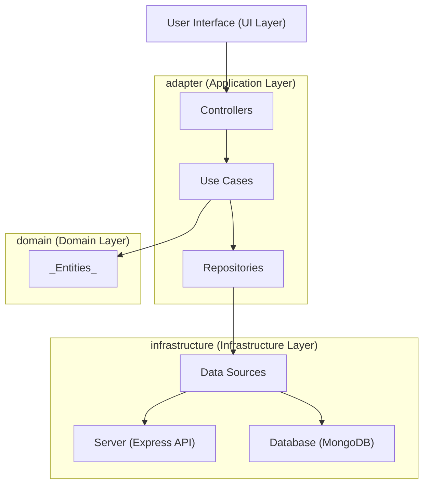

# DailyTrends API

An API project that exposes a news feed.

## Table of Contents

- [DailyTrends API](#dailytrends-api)
  - [Table of Contents](#table-of-contents)
  - [Description](#description)
    - [Architecture](#architecture)
    - [Object Oriented Designs](#object-oriented-designs)
  - [Principals Tools](#principals-tools)
  - [Installation](#installation)
  - [Usage](#usage)
  - [Roadmap](#roadmap)

## Description

DailyTrends is an API that exposes a news feed aggregator. This feed collects news from different newspapers, focusing on the top headlines from leading newspapers. When a user accesses DailyTrends, they will see the top 5 headlines from `El País` and `El Mundo` for the current day. Additionally, users can manually add news articles through the API.

### Architecture

The **Clean Architecture** principles is used, which divide issues into layers and guarantee that business logic and infrastructure concerns are kept distinct from one another. Principal benefits consist of:

- **Maintainability**: The codebase is easier to maintain and update when there is a clear separation of concerns.
- **Scalability**: The architecture permits the system to expand and change without requiring significant reorganization.
- **Testability**: Comprehensive unit testing is made possible by the isolation of business logic from external dependencies.
- **Adaptability**: Modifications to external frameworks or dependencies little affect the main business logic.

#### Diagram



### Object Oriented Designs

Throughout the project's development, the SOLID principles have been followed, which combined help to maintain a clean architectural structure and improve the project's overall quality and maintainability.

## Principals Tools

- Node.js
- npm (Node Package Manager)
- TypeScript
- Express
- Eslint
- Jest
- Docker

## Installation

1. Clone the repository:
   ```bash
   git clone <repository_url>
   ```

2. Install dependencies:
   ```bash
   npm install
   ```

## Usage

## Roadmap

- [List of Task](./TODO.md)

## Best Practices

Resume of best practices followed to ensure code quality, maintainability, and security:

1. **Dependency Management**:
   - Specify the exact version of each dependency to ensure consistent builds, so avoid unexpected behavior due to dependency updates.
2. **Environment Variables**:
   - Configurable information, such as Database connection strings, or data configuration.   
   >  `dotenv` to load environment variables from a `.env` file.
3. **Authentication and Authorization**:
   - Secure your application by implementing authentication and authorization mechanisms.
   > `jsonwebtoken` for generating and verifying JSON Web Tokens (JWTs) and `bcrypt` for hashing passwords
4. **Security**:
   - Implement measures to mitigate common security threats, such as:
     - Using `bcrypt` for secure password hashing.
     - Implementing authentication and authorization mechanisms with `jsonwebtoken`.
     - Integrating `express-rate-limit` to prevent DDoS attacks by limiting the number of requests from a single IP address or user.
