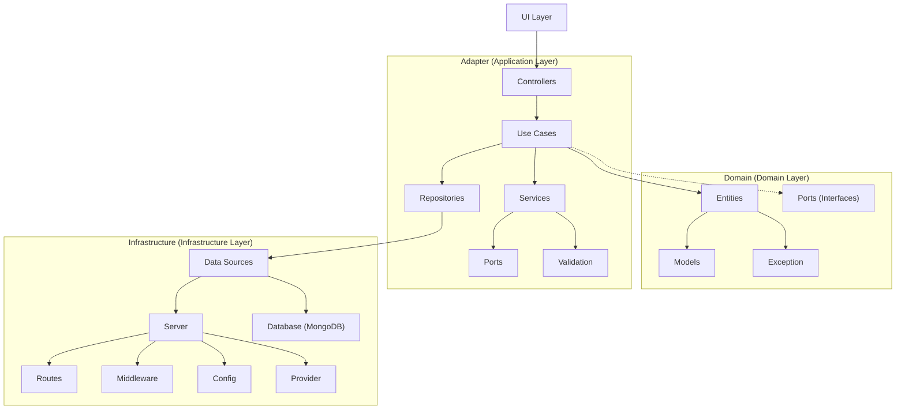

# DailyTrends API 📈

An API project that exposes a news feed.

## Table of Contents 📋

- [DailyTrends API 📈](#dailytrends-api-)
  - [Table of Contents 📋](#table-of-contents-)
  - [Description 📄](#description-)
    - [Architecture 🏛️](#architecture-️)
      - [Diagram 📊](#diagram-)
    - [Flowcharts 📝](#flowcharts-)
    - [Object Oriented Designs 💻](#object-oriented-designs-)
  - [Principal Tools 🛠️](#principal-tools-️)
  - [Installation 💾](#installation-)
  - [Usage 🚀](#usage-)
    - [Environment Variables 🌐](#environment-variables-)
    - [Running the Application ▶️](#running-the-application-️)
    - [Development Mode 👩‍💻](#development-mode-)
    - [Docker Usage 🐳](#docker-usage-)
      - [Development Image 🛠️](#development-image-️)
      - [Production Image 📦](#production-image-)
    - [Testing 🧪](#testing-)
    - [Code Formatting and Linting 🧹](#code-formatting-and-linting-)
    - [API Documentation 📜](#api-documentation-)
      - [Postman 📬](#postman-)
  - [Roadmap 🛤️](#roadmap-️)
  - [Best Practices 🌟](#best-practices-)
    - [CI/CD Workflows](#cicd-workflows)
      - [1. Run Tests](#1-run-tests)
      - [2. Code Quality and Bug Detection](#2-code-quality-and-bug-detection)
      - [3. Build Image and Push to Registry](#3-build-image-and-push-to-registry)
      - [4. Automate Release Creation](#4-automate-release-creation)
  
## Description 📄

DailyTrends is an API that exposes a news feed aggregator. This feed collects news from different newspapers, focusing on the top headlines from leading newspapers. When a user accesses DailyTrends, they will see the top 5 headlines from `El País` and `El Mundo` for the current day. Additionally, users can manually add news articles through the API.

### Architecture 🏛️

The **Clean Architecture** principles is used, which divide issues into layers and guarantee that business logic and infrastructure concerns are kept distinct from one another. Principal benefits consist of:

- **Maintainability**: The codebase is easier to maintain and update when there is a clear separation of concerns.
- **Scalability**: The architecture permits the system to expand and change without requiring significant reorganization.
- **Testability**: Comprehensive unit testing is made possible by the isolation of business logic from external dependencies.
- **Adaptability**: Modifications to external frameworks or dependencies little affect the main business logic.

#### Diagram 📊



### Flowcharts 📝

1. [User Registration, Login, Token Usage, and Release Process](diagrams/user-registration-login-process.md)
2. [Detailed eScrape Process](diagrams/escrape-process.md)

### Object Oriented Designs 💻

Throughout the project's development, the SOLID principles have been followed, which combined help to maintain a clean architectural structure and improve the project's overall quality and maintainability.

## Principal Tools 🛠️

- Node.js
- npm (Node Package Manager)
- TypeScript
- Express
- Eslint
- Jest
- Swagger and Postman
- Prettier
- Docker

## Installation 💾

1. Clone the repository:
   ```bash
   git clone <repository_url>
   ```

2. Install dependencies:
   ```bash
   npm install
   ```

3. Compile the TypeScript files to JavaScript:
   ```bash
   npx tsc
   ```

## Usage 🚀

### Environment Variables 🌐

The application uses environment variables for configuration. Below is a table describing each environment variable:

| Variable                   | Description                                         | Default Value                            |
|----------------------------|-----------------------------------------------------|------------------------------------------|
| `JWT_SECRET_KEY`           | Secret key for JWT authentication.                  | `default_secret_key`                     |
| `MONGODB_CONNECTION_STRING`| MongoDB connection string.                          | `mongodb://localhost:27018/mydatabase`   |
| `NODE_ENV`                 | Environment the application is running in.          | `development`                            |
| `PORT`                     | The port on which the application runs.             | `3000`                                   |
| `RATE_LIMIT_WINDOW_MS`     | Timeframe for rate limit in milliseconds.           | `900000` (15 minutes)                    |

### Running the Application ▶️

1. Install Dependencies:
   ```bash
   npm install
   ```

2. Start `mongo` via `docker-compose`:
   ```bash
   docker-compose up mongo
   ```

3. Start the application:
   ```bash
   npm run start
   ```

> This will run the compiled JavaScript files located in the `dist` directory.

### Development Mode 👩‍💻

To run the application in development mode with a MongoDB connection string:
   ```bash
   docker-compose up mongo
   npm run start:dev
   ```

> This script sets the MongoDB connection string environment variable (url to connect `docker-compose up mongo`) and starts the application.

### Docker Usage 🐳

First, use the `.env` file based on the `.env_example` template:

```plaintext
# .env_example File
# Environment variables for application
JWT_SECRET_KEY=default_secret_key
MONGODB_CONNECTION_STRING=mongodb://localhost:27018/mydatabase
NODE_ENV=development
PORT=3000
RATE_LIMIT_WINDOW_MS=900000
RATE_LIMIT=100
```

This case uses a multi-stage Docker build to separate development and production environments:

#### Development Image 🛠️

```bash
docker build --target development -t dailytrends-dev .
docker run --env-file .env -p 3000:3000 dailytrends-dev
```

#### Production Image 📦

```bash
docker build --target production -t dailytrends-prod .
docker run --env-file .env -p 80:3000 dailytrends-prod
```

### Testing 🧪

Run integration tests using:
   ```bash
   # All tests
   npm run test 
   # Only Integration tests
   npm run test:integration
   ```

### Code Formatting and Linting 🧹

   ```bash
   npm run format
   ```

To lint TypeScript files:

   ```bash
   npm run lint
   ```

For automatically fixing linting errors:

   ```bash
   npm run lint:fix
   ```

### API Documentation 📜

Swagger has been implemented via comments to automatically generate the API specification:

   ```bash
   http://localhost:3000/api-docs
   ```

> NOTE: This is feasible for small projects like this one, but for larger projects it is advisable to create a separate specification file manually.

#### Postman 📬

A collection Postman [here](./docs/API%20DAILYTRENDS.postman_collection.json)

## Roadmap 🛤️

- [List of Task](./TODO.md)

## Best Practices 🌟

Resume of best practices followed to ensure code quality, maintainability, and security:

1. **Dependency Management**:
   - Specify the exact version of each dependency to ensure consistent builds, so avoid unexpected behavior due to dependency updates.
2. **Environment Variables**:
   - Configurable information, such as Database connection strings, or data configuration.   
   >  `dotenv` to load environment variables from a `.env` file.
3. **Authentication and Authorization**:
   - Secure your application by implementing authentication and authorization mechanisms.
   > `jsonwebtoken` for generating and verifying JSON Web Tokens (JWTs) and `bcrypt` for hashing passwords
4. **Security**:
   - Implement measures to mitigate common security threats, such as:
     - Using `bcrypt` for secure password hashing.
     - Implementing authentication and authorization mechanisms with `jsonwebtoken`.
     - Integrating `express-rate-limit` to prevent DDoS attacks by limiting the number of requests from a single IP address or user.
5. **Documentation**
   -  Maintain clear documentation for the API:
      - Using `Swagger and OpenAPI` for documentation API endpoints, expected inputs, and outputs.

### CI/CD Workflows

#### 1. Run Tests

- **File**: `test_code.yml`
- **Description**: This workflow is triggered on pushes or pull requests to the `main` or `develop` branches. It runs tests for the project.
> Serves as part of the Continuous Integration (CI) process, ensuring that changes introduced to the codebase do not break existing functionality.

#### 2. Code Quality and Bug Detection

- **File**: `check_code.yml`
- **Description**: This workflow is also triggered on pushes or pull requests to the `main` or `develop` branches. It focuses on code quality checks using ESLint.
> Contributes to the Continuous Integration (CI) process by enforcing code quality standards and detecting potential bugs early in the development cycle.

#### 3. Build Image and Push to Registry

- **File**: `build-and-publish.yml`
- **Description**: This workflow has a more complex triggering mechanism. It's triggered on pushes to the `main` branch, specific version tags, or closed pull requests to the `main` branch. It builds a Docker image and pushes it to a container registry.
> Handles aspects of Continuous Integration (CI) and Continuous Delivery (CD). It automates the process of building and deploying containerized applications, ensuring consistency and reliability across environments.

#### 4. Automate Release Creation

- **File**: `automate-release.yml`
- **Description**: This workflow is triggered when pull requests are closed on the `main` branch or manually triggered. It automates the creation of GitHub releases based on pull request information.
> Handles aspects of Continuous Deployment (CD) by 88automatically creating releases** on GitHub when changes are merged into the `main` branch.
