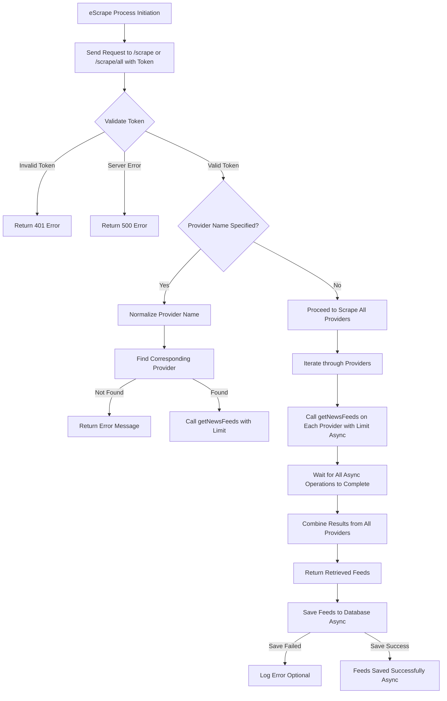

# Detailed eScrape Process

```mermaid
flowchart TD
    A[eScrape Process Initiation] --> B[Send Request to /scrape or /scrape/all with Token]
    B --> C{Validate Token}
    C -->|Invalid Token| D[Return 401 Error]
    C -->|Server Error| E[Return 500 Error]
    C -->|Valid Token| F{Provider Name Specified?}
    F -->|Yes| G[Normalize Provider Name]
    F -->|No| H[Proceed to Scrape All Providers]
    G --> I[Find Corresponding Provider]
    I -->|Not Found| J[Return Error Message]
    I -->|Found| K[Call getNewsFeeds with Limit]
    H --> L[Iterate through Providers]
    L --> M[Call getNewsFeeds on Each Provider with Limit Async]
    M --> N[Wait for All Async Operations to Complete]
    N --> O[Combine Results from All Providers]
    O --> P[Return Retrieved Feeds]
    P --> Q[Save Feeds to Database Async]
    Q -->|Save Failed| R[Log Error Optional]
    Q -->|Save Success| S[Feeds Saved Successfully Async]
```
