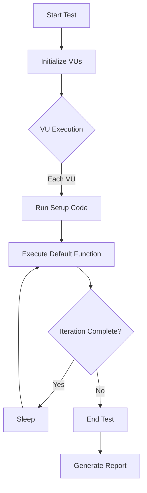
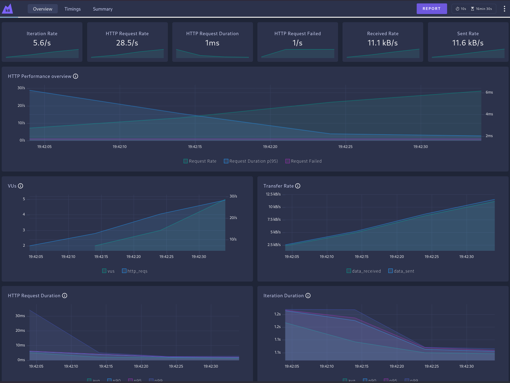

# 🚀 E2E - Perform a load test on the API

This folder contains K6 load testing scripts for evaluating the performance, reliability, and scalability of APIs. K6 is an open-source load testing tool designed for testing the performance of backend systems, including APIs, microservices, and websites.

K6 test can be considered an end-to-end (E2E) test if it is designed to verify the entire workflow of a system from start to finish, including interactions between components like APIs, databases, and external services.

> **TAKE A LOOK**:
>
> - 👉 More information about [K6 Motivation on this project](../docs/k6/about-load-k6.md)
>
> - 👉 More information about [K6 Best practices](../docs/k6/k6-best-practices.md)

## 📁 Folder Structure

```bash
├── .env_des                       # Dev environment (default)
├── .env_test                      # Testing environment
├── .env_pre                       # Pre-production
├── .env_pro                       # Production (careful!)
├── Makefile
├── docker-compose.yml
├── load-tests/
│   └── k6/
│       ├── load_test_feeds_performance.js
│       ├── load_test_e2e_api.js
│       ├── load_basic_structured_test.js
│       ├── clients/
│       │   └── http-client.js
│       ├── constants.js
│       ├── index.js
│       ├── services/
│       │   └── http-service.js
│       └── utils/
│           ├── http-utils.js
│           ├── random-utils.js
│           └── wait-k6.js
```

---

## 🛠️ Prerequisites

Before running the load tests, ensure you have the following installed:

1. **Docker**: Install Docker from [here](https://docs.docker.com/get-docker/).
2. **K6**: Optionally, you can install K6 locally from [here](https://k6.io/docs/getting-started/installation/).

---

## 🚦 Running the Load Tests


### 🚦 Using the `Makefile`

#### 🔥 Running Full Stack (API + K6 + Monitoring)

To run the full system including performance monitoring with K6, InfluxDB, and Grafana:

```bash
make test-basic     # load_basic_structured_test.js
make test-e2e       # load_test_e2e_api.js
make test-feeds     # load_test_feeds_performance.js
```

> DEFAULT: `ENV=DES` to use .env_des, ENV=TEST to use .env_test

Want to run a custom script?

```bash
make test SCRIPT=my_script.js ENV=des
```

These will be executed via the K6 Docker container defined in `docker-compose.yml`.

👉 More details about the `Makefile` can run `make help`.

#### ⚙️ Environments via `.env_<ENV>`

Environment-specific config is handled via `.env` files:

- `.env_des`: development
- `.env_test`: testing
- `.env_pre`: pre-production
- `.env_pro`: production

Each file should include environment variables like:

```bash
MONGODB_CONNECTION_STRING=mongodb://mongo:27017/mydatabase_dev
REDIS_URL=redis
REDIS_PORT=6379
BASE_URL=http://localhost:8087

#
# Common k6 perf profile
#
HOST=http://localhost:8087
VUS=10
ITERATIONS=100
#
# FOR load_basic_structured_test.js
#
WAIT_TIME=300
WAIT_TIME_RANDOM=20
AUTHORIZATION=Bearer
# USER=
# PASSWORD=
# JWT_TOKEN=
# Path Weights for Various Endpoints
PATH_WEIGHT_1=0.6
PATH_WEIGHT_2=0.2
PATH_WEIGHT_3=0.2
```

[Grafana dashboards](https://grafana.com/docs/k6/latest/results-output/grafana-dashboards/)

### **Using K6 image directly**

Run the K6 load tests using Docker without needing to install K6 locally.

👉 More information about K6 on this project can be found [here](../docs/k6/ABOUT_LOAD_K6.md)

#### Steps

1. **Target to running app locally**

 > **(Previous) Test API:** Before running the load tests, ensure the API is up and running. You can start the API using the following documentation: [API TESTING](../docs/<script-k6>ING_GUIDE.md)

2. **Run the K6 Script**:
   Use the following command to run the `<script-k6>.js` script:

   ```bash
   docker run -i --rm \
     -v $(pwd)/load-tests:/app \
     -e TARGET_HOST=http://localhost:8087 \
     -e VUS=1 \
     -e ITERATIONS=1 \
     grafana/k6:latest \
     run /app/k6/<script-k6>.js
   ```

   - **`-v $(pwd)/load-tests:/app`**: Mounts the `load-tests` folder to the `/app` directory inside the container.
   - **`-e TARGET_HOST=http://localhost:8087`**: Sets the `TARGET_HOST` environment variable to your API's base URL.
   - **`-e VUS=1`**: Sets the number of Virtual Users (VUs) to 1.
   - **`-e ITERATIONS=1`**: Limits the test to 1 iteration.
   - **`grafana/k6:latest`**: Uses the official K6 Docker image.
   - **`run /app/k6/<script-k6>.js`**: Runs the `<script-k6>.js` script.
  
   > **NOTE**: If **TARGET APP** is running via docker-compose, you must include:.
   > flag: --add-host=host.docker.internal:172.17.0.1
   > TARGET_HOST=http://host.docker.internal:8087
  
3. **Run with Different Parameters**:
   You can adjust the `VUS` and `ITERATIONS` values to suit your testing needs. For example:

   ```bash
   docker run -i --rm \
     -v $(pwd)/load-tests:/app \
     -e TARGET_HOST=http://localhost:8087 \
     -e VUS=10 \
     -e ITERATIONS=100 \
     grafana/k6:latest \
     run /app/k6/<script-k6>.js
   ```

Exist Environment Variables for K6: [Configure k6 options with environment variable](https://grafana.com/docs/k6/latest/using-k6/environment-variables/#configure-k6-options-with-environment-variables)

---

### **Using K6 Locally**

If you have K6 installed locally, you can run the scripts directly.

#### Steps

1. **Navigate to the `load-tests` Folder**:
   Open a terminal and navigate to the `load-tests` folder:

   ```bash
   cd load-tests
   ```

2. **Run the Script**:
   Use the following command to run the `<script-k6>.js` script:

   ```bash
   k6 run k6/<script-k6>.js
   ```

3. **Pass Environment Variables**:
   You can pass environment variables using the `-e` flag:

   ```bash
   k6 run -e TARGET_HOST=http://localhost:8087 -e VUS=1 -e ITERATIONS=1 k6/<script-k6>.js
   ```

---

## 📊 How K6 Works with Virtual Users (VUs)

Below is a Mermaid diagram that explains how K6 works with Virtual Users (VUs):



### Explanation

1. **Start Test**: The test begins by initializing the specified number of Virtual Users (VUs).
2. **Initialize VUs**: Each VU is initialized and starts executing the test script.
3. **Run Setup Code**: If a `setup` function is defined, it runs once before the VUs start.
4. **Execute Default Function**: Each VU runs the `default` function repeatedly for the specified duration or iterations.
5. **Sleep**: After each iteration, the VU sleeps for a specified duration (if configured).
6. **End Test**: Once the test duration or iterations are complete, the test ends.
7. **Generate Report**: K6 generates a report with metrics like response times, success rates, and errors.

---

## 🧩 Script Details

### 📂 `k6/`

This folder contains all the necessary files for running the load tests.

#### 3. **`load_test_feeds_performance.js`**

This script is designed for performance/load testing. It simulates realistic traffic and validates the application's behavior under load.

**Flow:**

- Registers (or reuses) a user account.
- Logs in and obtains an authentication token (via the `setup()` function).
- Runs concurrent virtual users (`default`) that:
  - Create multiple news feeds for different providers.
  - Fetch a list of all feeds.
  - Scrape news content from one of the providers.
- Cleans up by deleting all created feeds (via the `teardown()` function).

### 1. **`load_test_e2e_api.js`**

This is the main script for API testing. It performs the following steps:

- Registers a new user.
- Logs in and retrieves an authentication token.
- Fetches news using the token.
- Performs feed management operations (create, read, update, delete).

### 2. **`load_basic_structured_test.js`**

Structured example of k6 script for running the load tests, including subfolders and files:

**Folder Structure**

- **`clients/`**: Contains HTTP client utilities.
- **`constants.js`**: Defines constants used across scripts.
- **`services/`**: Contains service-layer logic for making HTTP requests.
- **`utils/`**: Contains utility functions for HTTP, random data generation, and delays.

---

## Example: Running K6 Locally with Web dashboard

k6 provides a built-in web dashboard that you can enable to visualize and monitor your tests results in real-time: [Web dashboard](https://grafana.com/docs/k6/latest/results-output/web-dashboard/).

This is an example of how to run the `load_test_e2e_api.js` script using docker:

```bash
docker run -i --rm --add-host=host.docker.internal:172.17.0.1 -p 5665:5665 -v $(pwd)/load-tests:/app -e TARGET_HOST=http://host.docker.internal:8087 -e VUS=1 -e ITERATIONS=1 grafana/k6:latest run --out web-dashboard /app/k6/load_test_feeds_performance.js

         /\      Grafana   /‾‾/  
    /\  /  \     |\  __   /  /   
   /  \/    \    | |/ /  /   ‾‾\ 
  /          \   |   (  |  (‾)  |
 / __________ \  |_|\_\  \_____/ 

     execution: local
        script: /app/k6/load_test_feeds_performance.js
 web dashboard: http://127.0.0.1:5665
        output: -

     scenarios: (100.00%) 1 scenario, 20 max VUs, 16m30s max duration (incl. graceful stop):
              * default: Up to 20 looping VUs for 16m0s over 5 stages (gracefulRampDown: 30s, gracefulStop: 30s)
```

Now open your browser and navigate to http://127.0.0.1:5665 to view the dashboard:




> **Note**: This is just an example, and the **target application** is running on **local host via docker compose**. For the real-world scenario, the target application is running on a remote server.

---

## 🚨 Troubleshooting

The following are documentation and resources that can help you troubleshoot issues with k6 load testing:

- **📖 [k6 Troubleshooting during development](../docs/k6/k6-develop-Troubleshooting.mdg/)**.

---

## Future Improvements

- Metrics: Add more metrics to the dashboard for a more comprehensive view of the system's performance: CPU usage, memory usage, etc.
- K6 Metrics: Implement custom metrics for more detailed insights: 
  - Create custom metrics: https://grafana.com/docs/k6/latest/using-k6/metrics/create-custom-metrics/#create-custom-metrics
  - Prometheus remote write: https://grafana.com/docs/k6/latest/results-output/real-time/prometheus-remote-write/

## 📚 References

### Useful Resources for K6 Load Testing

- **📖 [How to do Performance Testing with k6](https://www.alexhyett.com/performance-testing/)**: A comprehensive guide to getting started with k6 for performance testing.
- **📖 [k6 Documentation](https://k6.io/docs/)**: Official documentation for k6, including tutorials, API references, and best practices.
- **📖 [k6 Cloud](https://k6.io/cloud)**: Learn how to scale your load tests using k6 Cloud for distributed testing.
- **📖 [k6 GitHub Repository](https://github.com/grafana/k6)**: Explore the source code, contribute, or report issues.
- **📖 [k6 Blog](https://k6.io/blog/)**: Stay updated with the latest news, tutorials, and case studies about k6.
- **📖 [k6 Slack Community](https://k6.io/slack)**: Join the k6 Slack community to ask questions and share knowledge with other users.
- **📖 [k6 Examples](https://github.com/grafana/k6-examples)**: A collection of example scripts for various use cases.

---

## 📜 License

This project is licensed under the [MIT License](LICENSE).
